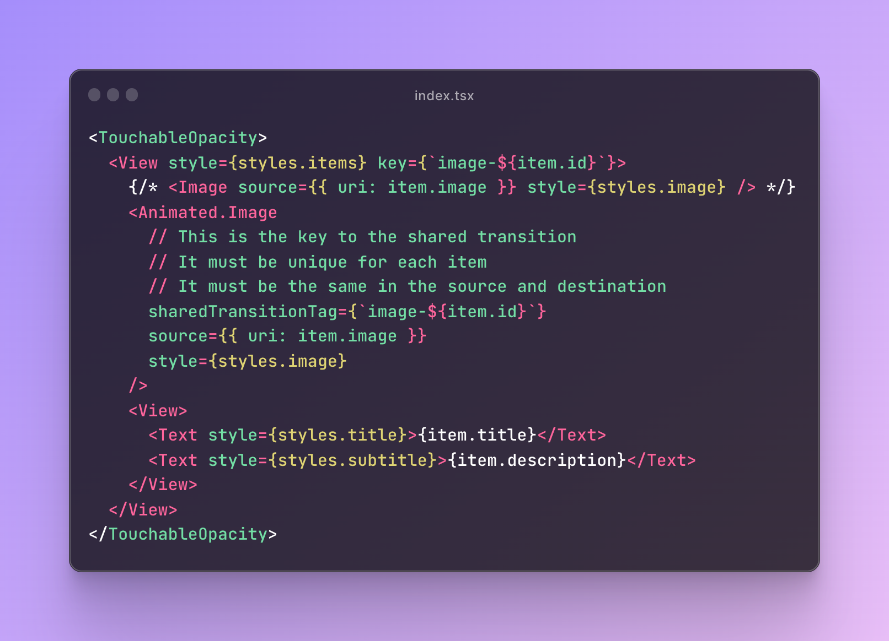
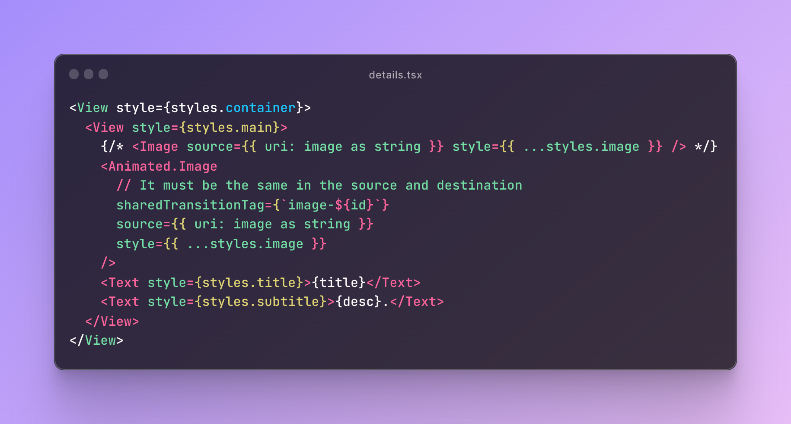

# Image transition between expo routes

This example shows how to use the `sharedTransitionTag` property to create an image transition between routes.

## List screen

[index.tsx](https://github.com/diegoguevara/rn-animations-image-transition-between-routes/blob/main/app/index.tsx)

## Details screen

[details.tsx](https://github.com/diegoguevara/rn-animations-image-transition-between-routes/blob/main/app/details.tsx)

